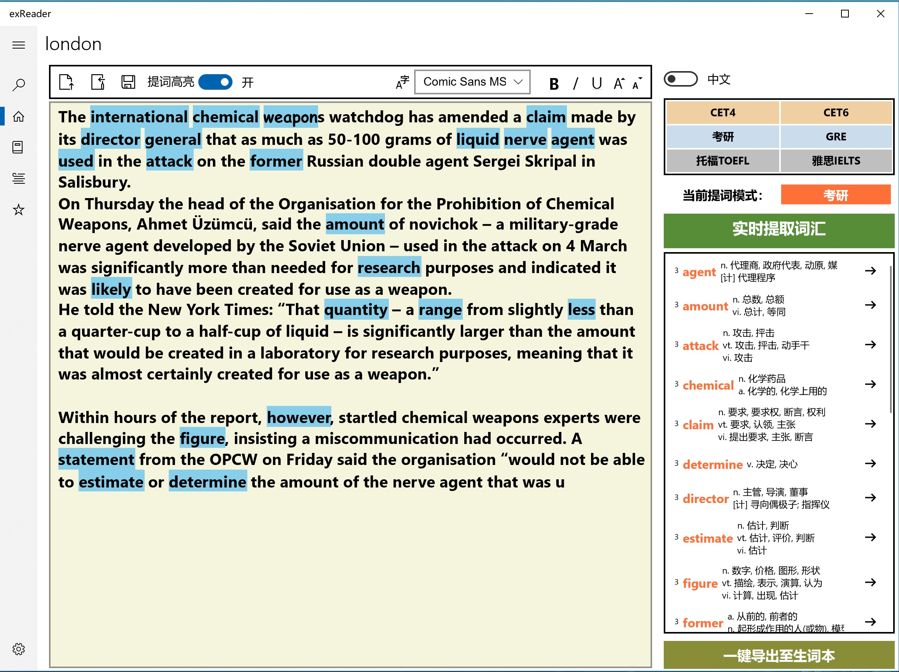
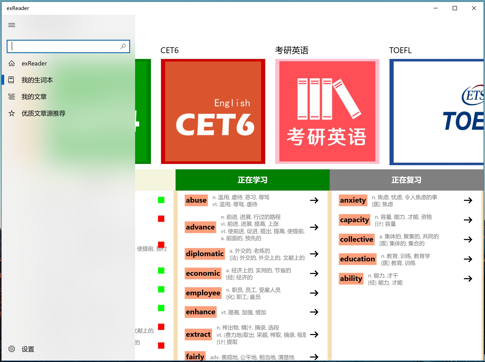
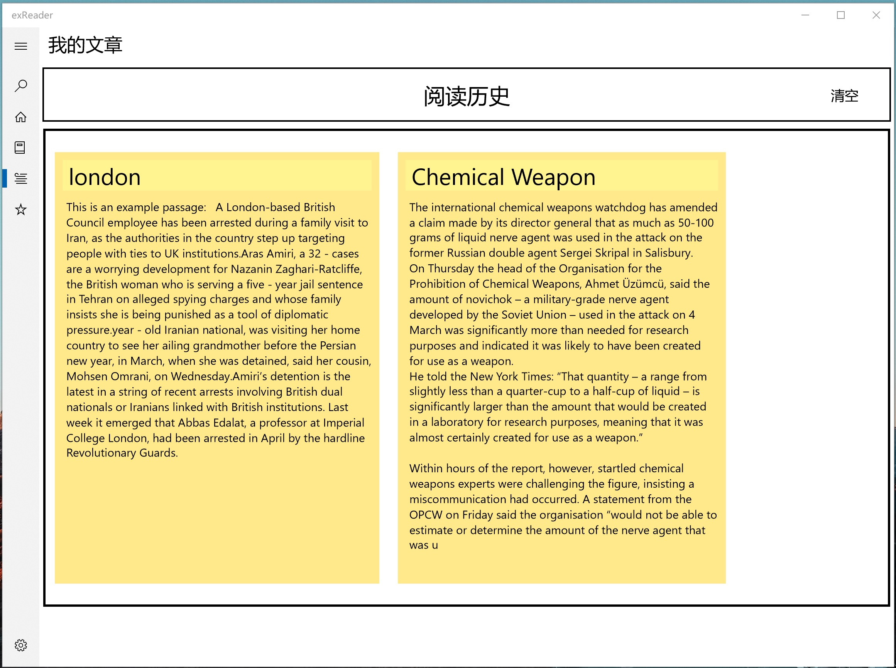
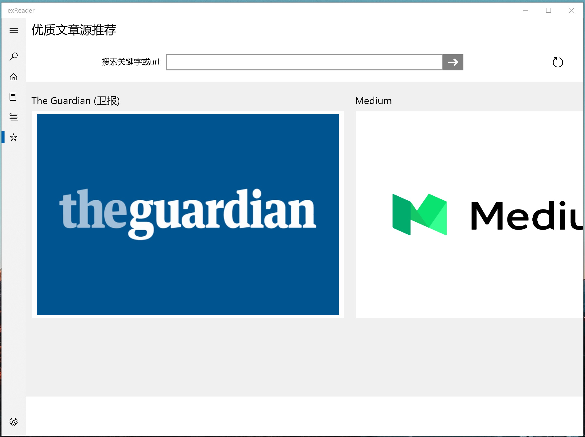

# exReader提词阅读器

## A English passage reader which target in extracting different classes of Vocabulary.

## exReader主页

- 在文本框粘贴你要阅读的文本
- 右上角选择提词模式
- 可选择将提的词导入单词本

## 我的生词本页面

- 这里收录你的提词记录
	- 正在学习的可以移到复习
	- 正在复习的可以移除单词表

## 我的文章界面
- 这里收录了你的保存文章
	- 点击可回到阅读界面
	- 可一键清空记录
	

## 优质文章源推荐
- 这里是优质源推荐
	- 可搜索文章和网址链接
	- 点击推荐项进入推荐网站主页

